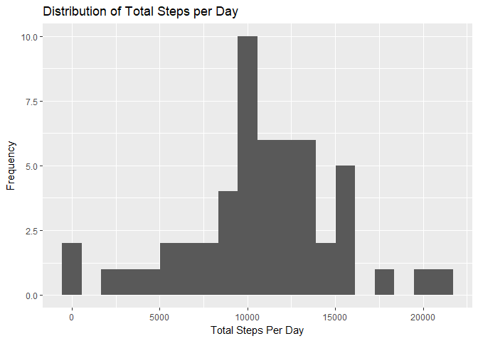
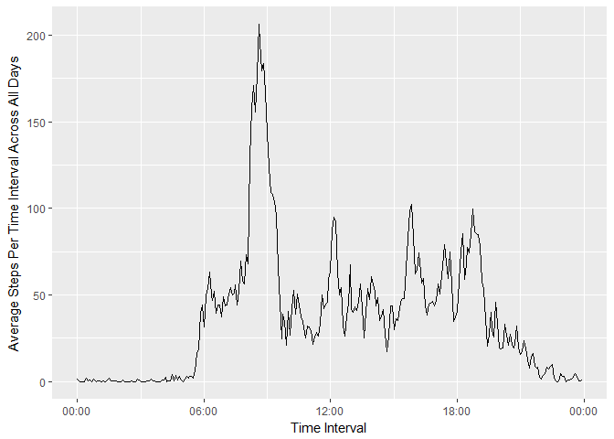
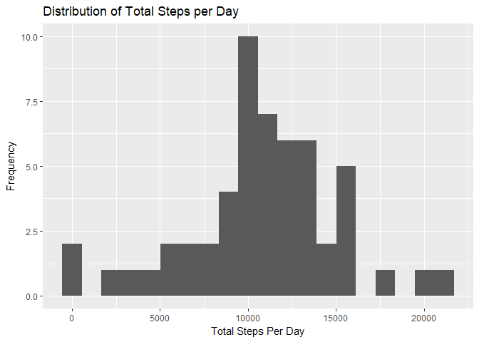
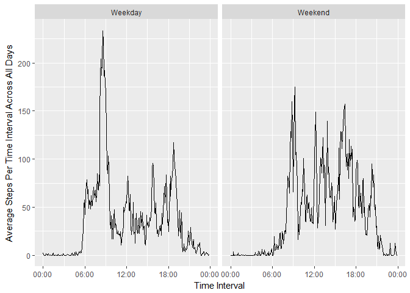

## Loading and preprocessing the data

Load the data from the csv file with specific classes for the columns


```r
activity = read.csv("activity.csv",
                    colClasses = c("integer","Date","integer"))
```

Pad the interval column with zeros to make it easier to use later


```r
activity$interval <- sprintf("%04d",activity$interval)
```


## What is mean total number of steps taken per day?

Sum the steps for each day using the aggregate function


```r
totalStepsPerDay = aggregate(steps ~ date, activity, sum )
```

Load the ggplot2 library and plot the distribution of steps per day on a histogram

```r
library(ggplot2)
g = ggplot(totalStepsPerDay, aes(steps))
g + geom_histogram(bins = 20) +
    ylab("Frequency") +
    xlab("Total Steps Per Day") +
    ggtitle("Distribution of Total Steps per Day")
```

<!-- -->

Calculate the mean steps per day


```r
mean(totalStepsPerDay$steps)
```

```
## [1] 10766.19
```

and the median steps per day


```r
median(totalStepsPerDay$steps)
```

```
## [1] 10765
```

## What is the average daily activity pattern?

Average the steps for each time interval using the aggregate function, and convert interval to a time


```r
avgStepsPerInterval = aggregate(steps ~ interval, activity, mean )
avgStepsPerInterval$time = strptime(avgStepsPerInterval$interval,"%H%M")
```

Plot a line chart of the average steps per time interval


```r
g = ggplot(avgStepsPerInterval, aes(time, steps))
g + geom_line() +
    scale_x_datetime(date_labels = "%H:%M") +
    ylab("Average Steps Per Time Interval Across All Days") +
    xlab("Time Interval")
```

<!-- -->

Find time interval with the maximum number of average steps


```r
avgStepsPerInterval[which.max(avgStepsPerInterval$steps),"interval"]
```

```
## [1] "0835"
```


## Imputing missing values

Calculate the total number of missing values in the dataset


```r
sum(is.na(activity$steps))
```

```
## [1] 2304
```

Replace missing values with the average for the 5-minute interval across days and store in a new data.frame called activityImp


```r
activityImp = activity
activityImp$steps = with(activityImp,  
                         ifelse(is.na(steps), 
                                avgStepsPerInterval$steps[avgStepsPerInterval$interval==interval], 
                                steps))
```

Sum the steps for each day using the aggregate function


```r
totalStepsPerDayImp = aggregate(steps ~ date, activityImp, sum )
```

Plot the distribution of steps per day on a histogram

```r
g = ggplot(totalStepsPerDayImp, aes(steps))
g + geom_histogram(bins = 20) +
    ylab("Frequency") +
    xlab("Total Steps Per Day") +
    ggtitle("Distribution of Total Steps per Day")
```

<!-- -->

Calculate the mean steps per day


```r
mean(totalStepsPerDayImp$steps)
```

```
## [1] 10766.19
```

and the median steps per day


```r
median(totalStepsPerDayImp$steps)
```

```
## [1] 10765.59
```

Determine how the mean and median steps per interval were affected by my chosen method of imputing the NA's:


```r
if(mean(totalStepsPerDay$steps) == mean(totalStepsPerDayImp$steps)){
    print("The mean was not affected.")
}else{
    if (mean(totalStepsPerDay$steps) > mean(totalStepsPerDayImp$steps)){
        print("The mean decreased.")
    }else{
        print("The mean increased.")
    }
}
```

```
## [1] "The mean was not affected."
```

```r
if(median(totalStepsPerDay$steps) == median(totalStepsPerDayImp$steps)){
    print("The median was not affected.")
}else{
    if (median(totalStepsPerDay$steps) > median(totalStepsPerDayImp$steps)){
        print("The median decreased.")
    }else{
        print("The median increased.")
    }
}
```

```
## [1] "The median increased."
```


## Are there differences in activity patterns between weekdays and weekends?

Create a new factor column in the imputed dataset indicating if the day is a weekend or weekday


```r
activityImp$WeekendOrWeekday = as.factor(
    ifelse(weekdays(activityImp$date) %in% c("Saturday","Sunday"),"Weekend","Weekday"))
```

Average the steps for each time interval using the aggregate function, and convert interval to a time


```r
avgStepsPerInterval = aggregate(steps ~ interval + WeekendOrWeekday, activityImp, mean )
avgStepsPerInterval$time = strptime(avgStepsPerInterval$interval,"%H%M")
```

Plot a line chart of the average steps per time interval for weekdays and weekends


```r
g = ggplot(avgStepsPerInterval, aes(time, steps))
g + geom_line() +
    facet_grid(. ~ WeekendOrWeekday) +
    scale_x_datetime(date_labels = "%H:%M") +
    ylab("Average Steps Per Time Interval Across All Days") +
    xlab("Time Interval")
```

<!-- -->
